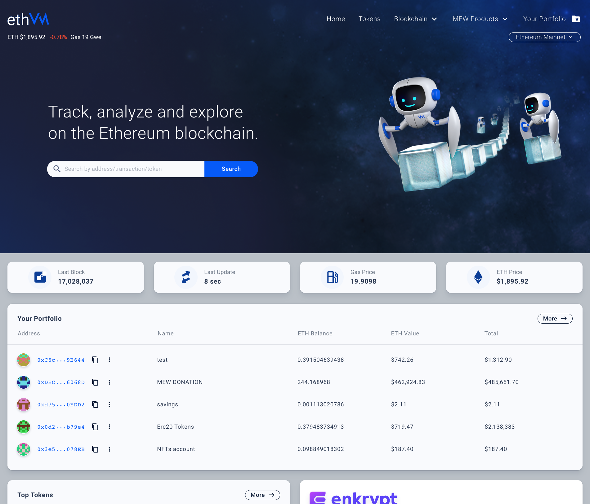

  
  
:zap::zap::zap: EthVM Project: An Open Source Proccessing Engine and Block Explorer for Ethereum, based on Apache Kafka :zap::zap::zap:

  
Powered by <a href="https://www.typescriptlang.org/">TypeScript</a> / <a href="https://vuejs.org/">VueJS</a> / <a href="https://github.com/socketio/socket.io">Socket.io</a> / <a href="https://kafka.apache.org/">Kafka + Kafka Streams + Kafka Connect</a> / <a href="https://github.com/ethereum/ethereumj">EthereumJ</a> (soon more clients) / <a href="https://github.com/mongodb/mongo">MongoDB</a> 
  

# EthVM: Open Source Processing Engine and Block Explorer for Ethereum

  
  
   
  
  

## Warning

We are on active development! So things may broke or not work as expected and documentation may be deprecated! You have been warned!

## Philosophy

We have strong foundations on how an Open Source blockchain explorer should be:

- **Empower the people**: Give people the ability to inspect the Ethereum blockchain easily, pretty much like [Etherscan](https://etherscan.io/) does but without being closed source.
- **Open source & audit-able**: Having an open source foundation, will guarantee free access to inspect, audit and modify whatever you want or need, without any vendor lock-in.
- **People are the Priority**: People are the most important & their experience trumps all else. If monetization worsens the experience, we don't do it. (e.g. ads).
- **A learning experience, too**: We want to educate about Ethereum, security, privacy, the importance of controlling your own keys, how the blockchain works, and how Ethereum and blockchain technologies enable a better world.
- **Private**: No tracking!!! No emails. No ads. No demographics. We don't even know who / what / where you are.

## Getting Started

For more information on how you can setup your environment and start developing on it, we recommend you to visit our [Wiki](https://github.com/enKryptIO/ethvm/wiki/)!

**NOTE**: Please, don't clone the repository blindly as there are a couple of steps you need to be aware before running the project!

## Contributing

We welcome every kind of contribution, so, please see [CONTRIBUTING](.github/CONTRIBUTING.md) for more details on how to proceed.

## License

This project is licensed under the SSPL License (a small variation of the GNU Affero License v3) - see the [LICENSE.md](LICENSE.md) file for details ([or read it here online](https://www.mongodb.com/licensing/server-side-public-license)).

  

