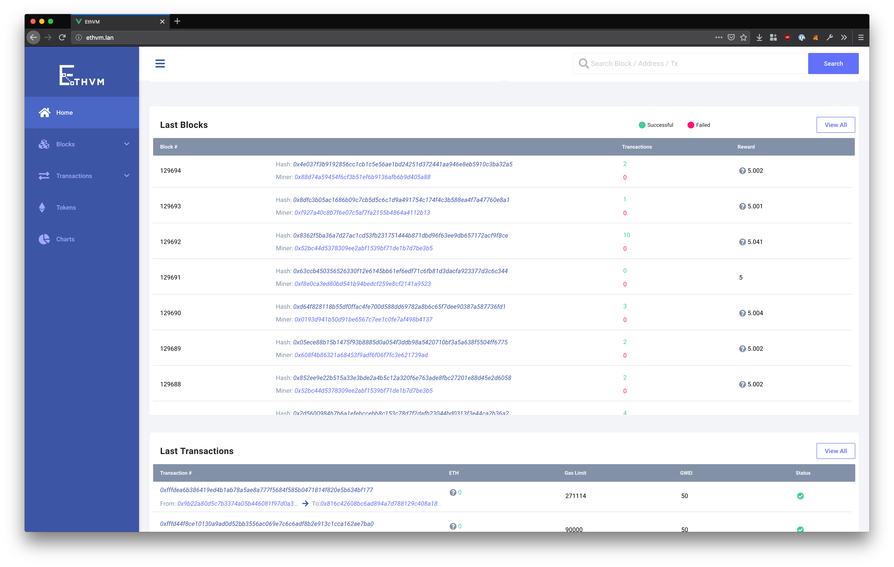

  
  
:zap: EthVM: An Open Source Proccessing Engine and Block Explorer for Ethereum, based on Apache Kafka :zap:

  
Powered by <a href="https://www.typescriptlang.org/">TypeScript</a> / <a href="https://vuejs.org/">VueJS</a>
  

# EthVM: Open Source Processing Engine and Block Explorer for Ethereum

  
  
  
  
  

## About

### What is EthVM?
EthVM is an open-source [Ethereum](https://www.ethereum.org/) Blockchain Data Processing and Analytics Engine with a client-side Block Explorer, although other networks and forks will be supported over time. EthVM is built by the [MyEtherWallet](https://github.com/MyEtherWallet) team and is secured under the [SSPL license](https://www.mongodb.com/licensing/server-side-public-license) (a small variation of the GNU Affero License v3) and is written in a mixture of different languages.

Our core infrastructure is based on well known languages:

- [TypeScript](https://www.typescriptlang.org/) (Block Explorer)
- Javascript (API/Processor)

And also is backed by popular frameworks:

- [VueJs](https://vuejs.org/)
- [Apollo Graphql](https://www.apollographql.com/)
- [Serverless](https://www.serverless.com/)
- [DynamoDB](https://aws.amazon.com/dynamodb/)

Our Block Explorer is currently in Beta right now. You can check it out live at [www.ethvm.com](https://www.ethvm.com/) and read more about it [here](https://medium.com/myetherwallet/introducing-mews-ethereum-blockchain-explorer-ethvm-beta-78e5b849e2fc). We are currently focused on bug fixes while we work on adding new features in the near future. If you have any questions or requests, feel free to open an issue or send us an email at *dev@ethvm.com*.

## Getting Started

Right now you can only view EthVM’s Block Explorer (front-end) code. We will be merging the api and processor into the same repo within a couple of weeks, so you can inspect the entire project after the merge.

You can run  `yarn start:dev` within the newclient folder, but you will not be able to propagate any data to the front-end, since the api code base has yet to be merged. However, you can still check out the front-end, and we greatly appreciate any PRs that can improve on code readability - including commentary and structure!

## Contributing

We welcome every kind of contribution, so, please see [CONTRIBUTING](.github/CONTRIBUTING.md) for more details on how to proceed.

## Stay in touch!

We have created our `EthVM - Devs` [Telegram channel](https://t.me/ethvm), feel free to join and hang out!
You can also reach out to us on [Twitter](https://twitter.com/Eth_VM) and [Reddit](https://www.reddit.com/r/ethvm/).

## About [MyEtherWallet](https://github.com/MyEtherWallet) Inc

EthVM is backed by the team of [MyEtherWallet](https://github.com/MyEtherWallet) (MEW), Ethereum’s original wallet. The MEW team is a group of Ethereum-enthusiasts dedicated to building open-source, intuitive products for the Ethereum community. Our team is committed to providing safe spaces for users to view and interact with their funds, without having to worry about who has access to their information and data.

All of our products are completely open-source and available on GitHub for review:

[MyEtherWallet Inc](https://github.com/MyEtherWallet/MyEtherWallet)

[Knowledge Base](https://github.com/MyEtherWallet/knowledge-base)

[MEWconnect Protocol](https://github.com/MyEtherWallet/MEWconnect)

## License

This project is licensed under the SSPL License (a small variation of the GNU Affero License v3) - see the [LICENSE](LICENSE) file for details ([or read it here online](https://www.mongodb.com/licensing/server-side-public-license)).

  

